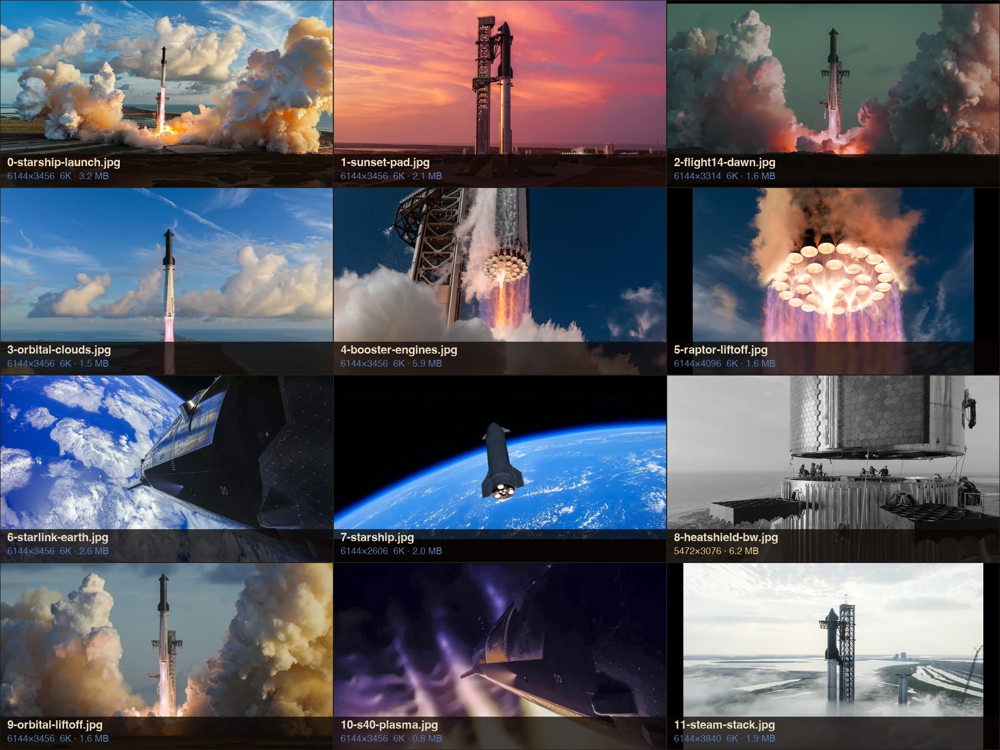

# Space

Repo: [stevederico/omarchy-space-theme](https://github.com/stevederico/omarchy-space-theme).

Omarchy theme from the Space design system: [stevederico/space-ui](https://github.com/stevederico/space-ui).

Sister theme: [Burn](https://github.com/stevederico/omarchy-burn-theme), Super Heavy night static fire.

Dark-first marketing chrome. Colors extracted by [Aether](https://github.com/omacom/aether) from the default Starship launch photo: launch-night black, exhaust cream, sky blue ring. Square corners, hairline borders, glass bar. Not Brutalist.




## Palette

| Role | Token | Hex |
|------|--------|-----|
| Background | launch night | `#0B0401` |
| Card | launch gray | `#231D1A` |
| Border | cream 15% | `#EDDDC3` at 15% |
| Text | exhaust cream | `#EDDDC3` |
| Muted | secondary text | `#6D6763` |
| Accent / ring | sky blue | `#537CBB` |
| Flame | green slot | `#EFCF84` |
| Info | cyan | `#67AFDF` |

Regenerate from a photo without applying it:

```bash
aether --generate backgrounds/0-starship-launch.jpg --no-apply --output /tmp/aether
```

Active window border is sky blue. Inactive is a cream hairline. Hyprland rounding is 0 so windows and the shell stay square.

## Install

```bash
omarchy theme install https://github.com/stevederico/omarchy-space-theme
```

Installs as `space` and applies it right away. Git installs drop `*.lua`, so the theme's `hyprland.lua` (square corners, hairline border) is skipped. To keep it, install as a user theme instead:

```bash
git clone https://github.com/stevederico/omarchy-space-theme.git ~/.config/omarchy/themes/space
# then remove .git so Omarchy keeps hyprland.lua
rm -rf ~/.config/omarchy/themes/space/.git
omarchy theme set space
```

Or copy from a checkout:

```bash
mkdir -p ~/.config/omarchy/themes/space
cp -a colors.toml hyprland.lua shell.toml icons.theme keyboard.rgb preview.png backgrounds \
  ~/.config/omarchy/themes/space/
omarchy theme set space
```

Backgrounds cycle with Super+Ctrl+Space.

## Backgrounds

Most shots are SpaceX posts on X, saved as `orig` frames (X serves 4096 wide at most). `8` and `11` are camera originals from [flickr.com/photos/spacex](https://www.flickr.com/photos/spacex). spacex.com stills are 2600×1200 web crops, so none come from there.

| File | Size | Shot | Source |
|------|------|------|--------|
| `0-starship-launch.jpg` | 6144×3456 (6K) | Starship lifting off, sunlit steam **(default)** | [X post](https://x.com/SpaceX/status/2104654998034690329/photo/1) |
| `1-sunset-pad.jpg` | 6144×3456 (6K) | Stacked Starship, magenta sunset | [X image](https://pbs.twimg.com/media/HN635FUWYAAzbOB?format=jpg&name=orig) |
| `2-flight14-dawn.jpg` | 6144×3314 (6K) | Dawn liftoff, pink flame, Flight 14 | [X post](https://x.com/SpaceX/status/2105352066424017118/photo/2) |
| `3-orbital-clouds.jpg` | 6144×3456 (6K) | Starship climbing over clouds and coast, first orbital flight | [X post](https://x.com/SpaceX/status/2104654998034690329/photo/4) |
| `4-booster-engines.jpg` | 6144×3456 (6K) | Super Heavy engine bells, Flight 13 | [X post](https://x.com/SpaceX/status/2081088918703759549) |
| `5-raptor-liftoff.jpg` | 6144×4096 (6K) | Super Heavy liftoff, 33 Raptor 3 engines from below | [X post](https://x.com/SpaceX/status/2105061657558786148/photo/1) |
| `6-starlink-earth.jpg` | 6144×3456 (6K) | S41 over Earth, first orbital flight | [X post](https://x.com/SpaceX/status/2106090316747207047/photo/3) |
| `7-starship.jpg` | 6144×2606 (6K) | Starship over Earth | Desktop wallpaper, original source unknown |
| `8-heatshield-bw.jpg` | 6144×3454 (6K) | Heatshield stack, B&W | [Flickr 51369631902](https://www.flickr.com/photos/spacex/51369631902/sizes/o/) |
| `9-orbital-liftoff.jpg` | 6144×3456 (6K) | Liftoff in golden steam, first orbital flight | [X post](https://x.com/SpaceX/status/2104654998034690329/photo/2) |
| `10-s40-plasma.jpg` | 6144×3456 (6K) | S40 in plasma, Flight 13 | [X post](https://x.com/SpaceX/status/2081894924291654060) |
| `11-steam-stack.jpg` | 6144×3840 (6K) | Stack in steam | [Flickr 52621815136](https://www.flickr.com/photos/spacex/52621815136/sizes/o/) |

Photos © SpaceX.

(6K) rows are Topaz High Fidelity V2 2x upscales of the source (4x for `7-starship.jpg`), then lanczos down to a 6144 long edge.
